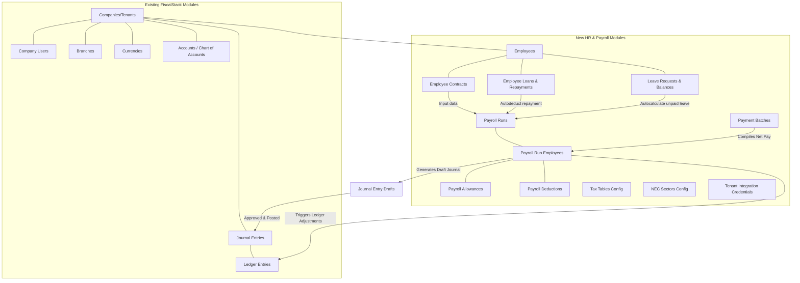
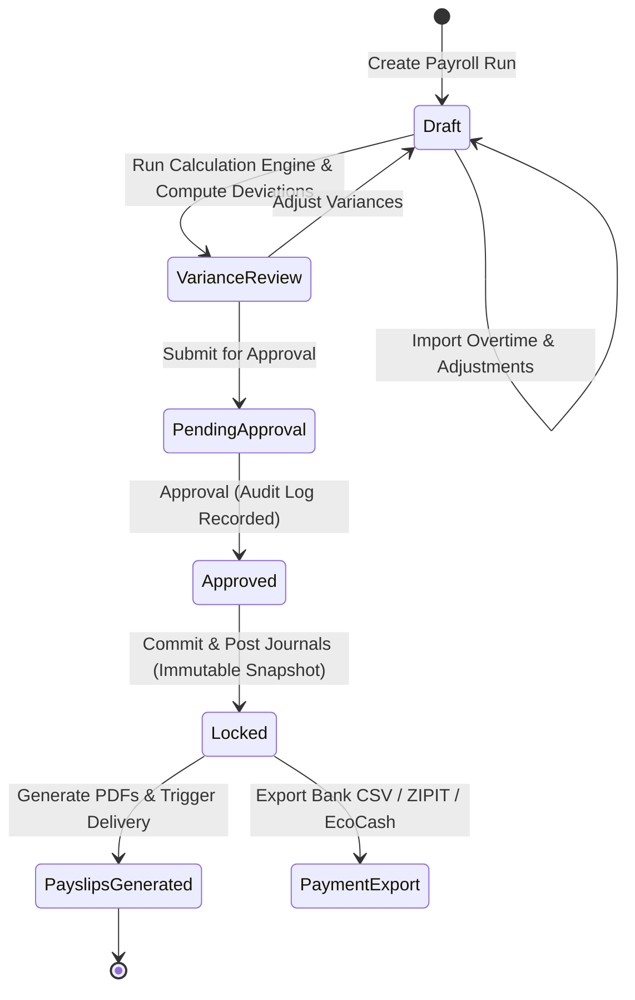
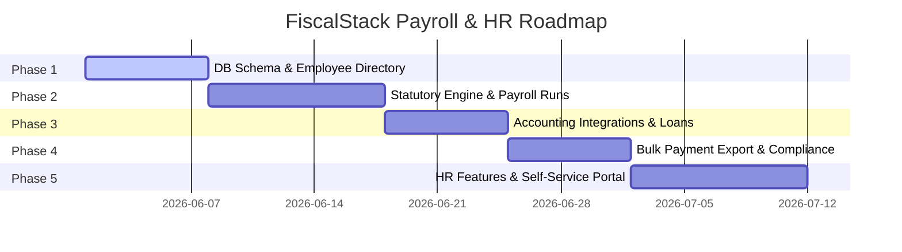

# FiscalStack HR & Payroll Module
## Production-Grade Architecture & Product Design Specification

This document details the complete product specification, system architecture, database schema, entity-relationship diagrams, API reference, user role permissions, UI structures, and Zimbabwean compliance engine logic for extending **FiscalStack** into a full HR & Payroll SaaS module.

---

## Zimbabwe Rules-Driven Payroll Architecture

FiscalStack Payroll must operate as a rules-driven Zimbabwe payroll engine, not a set of hardcoded statutory calculations. PAYE tables, AIDS levy percentages, NSSA ceilings/rates, NEC sector rules, pension treatment, earning definitions, deduction definitions, salary structures, pay grades, and notches are stored as effective-dated configuration. Future statutory changes should be applied by administrators as data changes, while historical payroll remains reproducible from stored snapshots.

The engine resolves the applicable rule versions for each payroll period and processes payroll in this order:

1. Gross earnings: basic salary, allowances, benefits, overtime, commission, bonus, back pay, leave pay, and once-off adjustments.
2. Pre-tax deductions: approved pension, retirement, and other configured tax-deductible deductions.
3. Taxable income: taxable and partially taxable earnings less approved pre-tax deductions.
4. PAYE: frequency-specific Zimbabwe tax table and tax-year version.
5. AIDS levy: configured percentage of PAYE for the effective period.
6. NSSA: pensionable earnings with exemption checks, rate application, and ceiling enforcement.
7. Post-tax deductions: loans, salary advances, medical aid, funeral cover, union fees, garnishees, and asset repayments.
8. Net salary, employer contributions, accounting postings, payment batches, and statutory reports.

Normalized rule tables:

- `payroll_tax_tables` and `payroll_tax_brackets` for PAYE tax years, frequencies, currencies, versions, effective dates, marginal rates, deductions, and source references.
- `payroll_statutory_rules` for AIDS levy, NSSA POBS, NEC, APWCS, pension, and future Zimbabwe statutory rules.
- `payroll_earning_types` for taxable, partially taxable, and non-taxable earning definitions with pensionable/NSSA flags.
- `payroll_deduction_types` for statutory, company, pension, loan, advance, medical aid, union, garnishee, and post-tax/pre-tax deductions.
- `payroll_salary_structures`, `payroll_pay_grades`, and `payroll_pay_grade_steps` for enterprise pay grades, midpoints, notches, and progression readiness.
- `employee_payroll_profiles` for employee-level payroll frequency, currency, grade, notch, exemptions, tax credits, and effective dating.

Every payroll line snapshot stores the rule IDs, rates, formulas, tax table, effective dates, inputs, outputs, previous snapshot hash, and calculation basis used for that employee. Finalized payroll is immutable; corrections use reversal runs, retroactive adjustments, correction journals, and audit records.

---

## Zimbabwe Statutory Reports & Returns Engine

FiscalStack Payroll includes a statutory reporting layer that generates reports from immutable payroll snapshots, never from live editable employee records. Each report stores its type, period, currency, payroll runs included, tax tables used, statutory rates used, validation results, report payload, generated user, generated date, version, export history, submission status, and snapshot hash.

Supported statutory and management reports:

- ZIMRA P2 monthly PAYE return: employer BP number, period, currency, gross remuneration, taxable remuneration, PAYE, AIDS levy, total PAYE payable, employee count, payment reference, submission status, amendments, and reversals.
- ZIMRA P6 employee tax certificate: annual, termination, and on-request employee tax certificate data.
- ZIMRA ITF16 annual return: employee-level annual payroll totals with cross-check readiness against monthly P2 and P6 certificate totals.
- NSSA contribution schedule: pensionable earnings, employee contribution, employer contribution, total payable, period, currency, exemptions, and adjustments.
- NEC contribution summaries: configurable sector/category basis, rates used, employee/employer contributions, and monthly payable values.
- Pension, benefits, union, garnishee, loan, salary advance, bank payment, EcoCash payout, payroll summary, variance, gross-to-net, cost-to-company, leave liability, payslip register, and reconciliation reports.

Validation before statutory export checks:

- Missing employer BP number and statutory registration data.
- Missing employee national ID/passport, ZIMRA tax number, NSSA number, start date, and termination date where applicable.
- Payroll runs not locked.
- Negative taxable income.
- PAYE, AIDS levy, and NSSA mismatches between report data and immutable payroll snapshots.
- Currency mismatch, unapproved adjustments, and missing statutory rule references.

Reconciliation requirements:

- Payroll run totals reconcile to payslip registers.
- Payroll run totals reconcile to P2, NSSA, NEC, and management reports.
- Monthly P2 totals reconcile to annual ITF16.
- Employee P6 totals reconcile to ITF16.
- PAYE/NSSA liabilities reconcile to accounting journals.
- Net pay reports reconcile to bank/EcoCash payment batches.
- Loan deductions reconcile to loan balances.

Report persistence tables:

- `payroll_statutory_reports` stores immutable report snapshots and submission status.
- `payroll_report_exports` stores PDF/CSV/Excel/ZIMRA electronic export history and file hashes.
- `payroll_report_validation_issues` stores validation errors/warnings before export.
- `payroll_statutory_deadlines` stores configurable ZIMRA/NSSA/NEC deadlines and reminders.

---

## 1. System Overview & Integration Context

FiscalStack is a Zimbabwean multi-tenant SaaS accounting and compliance ecosystem. The HR & Payroll module integrates into the platform by sharing core entities and extending the financial bookkeeping capabilities.



### Integration Touchpoints
1. **Multi-Tenancy (Row-Level Security)**: Every payroll table contains a `company_id` (integer) column. PostgreSQL Row-Level Security (RLS) policies isolate tenant data, ensuring that database queries automatically filter records based on the active company context.
2. **Double-Entry General Ledger**: The payroll processing workflow generates general ledger entries inside FiscalStack's `journal_entry_drafts` and `journal_entry_draft_lines` tables, mapping earnings and statutory obligations to configured chart of accounts (COA) lines (e.g. Salaries Expense, PAYE Payable, NSSA Payable).
3. **Currencies & Multi-Currency Ledger**: Zimbabwe operates in a multi-currency environment (primarily USD and ZiG). Payroll runs will specify their pay currency, pulling exchange rates from the existing `currencies` table for accounting postings.
4. **Branches**: Employees are associated with branches via the existing `branches` table, enabling cost-center segmentation and regional branch isolation.

---

## 2. Database Schema (Drizzle ORM & SQL DDL)

To preserve scalability, auditability, and historical calculation reproducibility, the schema uses separate configuration tables for tax rates and stores calculations in immutable snapshots inside `payroll_run_employees` via a `snapshot_data` JSONB field.

### Drizzle ORM Schema Definitions (TypeScript)

The following definitions should be appended to `shared/schema.ts` to represent the HR & Payroll database structure.

```typescript
import { 
  pgTable, text, serial, integer, boolean, timestamp, 
  decimal, numeric, jsonb, primaryKey, uuid, date, unique, index 
} from "drizzle-orm/pg-core";
import { relations } from "drizzle-orm";
import { companies, branches, accounts, users, journalEntries } from "./schema";

// 1. National Employment Council (NEC) Sectors Configuration
export const necSectorsConfig = pgTable("nec_sectors_config", {
  id: serial("id").primaryKey(),
  companyId: integer("company_id").references(() => companies.id), // Nullable for system-wide presets
  name: text("name").notNull(), // e.g. NEC Commercial Sector, NEC Construction, NEC Catering
  code: text("code").notNull(),
  employeeRate: decimal("employee_rate", { precision: 5, scale: 4 }).default("0.0000").notNull(), // e.g. 0.0100 for 1%
  employerRate: decimal("employer_rate", { precision: 5, scale: 4 }).default("0.0000").notNull(),
  fixedAmount: decimal("fixed_amount", { precision: 15, scale: 2 }).default("0.00").notNull(), // For flat fees
  isActive: boolean("is_active").default(true).notNull(),
  createdAt: timestamp("created_at").defaultNow(),
}, (table) => ({
  companyNecIdx: index("nec_sectors_company_idx").on(table.companyId),
}));

// 2. Departments Configuration
export const departments = pgTable("departments", {
  id: serial("id").primaryKey(),
  companyId: integer("company_id").references(() => companies.id).notNull(),
  name: text("name").notNull(),
  code: text("code"),
  glAccountId: integer("gl_account_id").references(() => accounts.id), // Direct payroll expense mapping
  isActive: boolean("is_active").default(true).notNull(),
  createdAt: timestamp("created_at").defaultNow(),
}, (table) => ({
  companyDeptIdx: index("departments_company_idx").on(table.companyId),
}));

// 3. Positions Configuration
export const positions = pgTable("positions", {
  id: serial("id").primaryKey(),
  companyId: integer("company_id").references(() => companies.id).notNull(),
  title: text("title").notNull(),
  grade: text("grade"), // e.g. D1, C3 (used for Grade-based/NEC payslips)
  necCategory: text("nec_category"), // National Employment Council classification
  isActive: boolean("is_active").default(true).notNull(),
  createdAt: timestamp("created_at").defaultNow(),
}, (table) => ({
  companyPosIdx: index("positions_company_idx").on(table.companyId),
}));

// 4. Employee Directory
export const employees = pgTable("employees", {
  id: serial("id").primaryKey(),
  companyId: integer("company_id").references(() => companies.id).notNull(),
  branchId: integer("branch_id").references(() => branches.id).notNull(),
  departmentId: integer("department_id").references(() => departments.id),
  positionId: integer("position_id").references(() => positions.id),
  
  employeeNumber: text("employee_number").notNull(), // User-facing identifier
  firstName: text("first_name").notNull(),
  lastName: text("last_name").notNull(),
  email: text("email"),
  phone: text("phone"),
  
  // Compliance identifiers
  nationalId: text("national_id").notNull(), // ID number in format: 12-345678X90
  nssaNumber: text("nssa_number"),
  zimraTaxNumber: text("zimra_tax_number"),
  
  // Banking details
  bankName: text("bank_name"),
  bankBranch: text("bank_branch"),
  bankAccountNumber: text("bank_account_number"),
  ecocashNumber: text("ecocash_number"), // Wallet details
  
  // Personal Details
  emergencyContactName: text("emergency_contact_name"),
  emergencyContactPhone: text("emergency_contact_phone"),
  status: text("status").default("ACTIVE").notNull(), // ACTIVE, INACTIVE, SUSPENDED, TERMINATED
  joiningDate: date("joining_date").notNull(),
  terminationDate: date("termination_date"),
  
  createdAt: timestamp("created_at").defaultNow(),
  updatedAt: timestamp("updated_at").defaultNow(),
}, (table) => ({
  companyEmpUnique: unique("employees_company_emp_no_unique").on(table.companyId, table.employeeNumber),
  companyIdx: index("employees_company_idx").on(table.companyId),
  branchIdx: index("employees_branch_idx").on(table.branchId),
  statusIdx: index("employees_status_idx").on(table.status),
}));

// 5. Employee Contracts (Finance Act Compliant Split-Currency Configuration)
export const employeeContracts = pgTable("employee_contracts", {
  id: serial("id").primaryKey(),
  employeeId: integer("employee_id").references(() => employees.id).notNull(),
  contractType: text("contract_type").default("PERMANENT").notNull(), // PERMANENT, FIXED_TERM, CASUAL
  startDate: date("start_date").notNull(),
  endDate: date("end_date"),
  payFrequency: text("pay_frequency").default("MONTHLY").notNull(), // MONTHLY, WEEKLY, FORTNIGHTLY, DAILY
  baseSalary: decimal("base_salary", { precision: 15, scale: 2 }).notNull(), // Total base salary in base contract currency
  currency: text("currency").default("USD").notNull(), // USD, ZiG, or SPLIT
  
  // Split Currency Multi-Currency Ratio Allocations
  usdPercentage: decimal("usd_percentage", { precision: 5, scale: 2 }).default("100.00").notNull(), // e.g. 70.00
  zigPercentage: decimal("zig_percentage", { precision: 5, scale: 2 }).default("0.00").notNull(),   // e.g. 30.00
  
  necSectorId: integer("nec_sector_id").references(() => necSectorsConfig.id), // Link to selected NEC config
  isActive: boolean("is_active").default(true).notNull(),
  createdAt: timestamp("created_at").defaultNow(),
}, (table) => ({
  employeeContractIdx: index("employee_contracts_employee_idx").on(table.employeeId),
}));

// 6. Statutory Configurations (Administratively configurable tax tables)
export const taxTablesConfig = pgTable("tax_tables_config", {
  id: serial("id").primaryKey(),
  currency: text("currency").default("USD").notNull(), // USD or ZiG
  effectiveFrom: date("effective_from").notNull(),
  effectiveTo: date("effective_to"),
  
  // Tax bracket definitions stored as JSONB array of objects:
  // [{ min: 0, max: 100, rate: 0, deduction: 0 }, { min: 101, max: 500, rate: 20, deduction: 20.20 }]
  brackets: jsonb("brackets").notNull(), 
  
  // NSSA configurations
  nssaRateEmployee: decimal("nssa_rate_employee", { precision: 5, scale: 4 }).default("0.0450").notNull(), // 4.5%
  nssaRateEmployer: decimal("nssa_rate_employer", { precision: 5, scale: 4 }).default("0.0450").notNull(), // 4.5%
  nssaCeilingLimit: decimal("nssa_ceiling_limit", { precision: 15, scale: 2 }).notNull(), // Max monthly salary base subject to NSSA
  
  // AIDS Levy
  aidsLevyRate: decimal("aids_levy_rate", { precision: 5, scale: 4 }).default("0.0300").notNull(), // 3.0% of PAYE
  
  isActive: boolean("is_active").default(true).notNull(),
  createdAt: timestamp("created_at").defaultNow(),
}, (table) => ({
  currencyPeriodIdx: index("tax_tables_currency_period_idx").on(table.currency, table.effectiveFrom),
}));

// 7. Recurring Earnings and Deductions (Salary templates per employee)
export const payrollRecurringItems = pgTable("payroll_recurring_items", {
  id: serial("id").primaryKey(),
  employeeId: integer("employee_id").references(() => employees.id).notNull(),
  type: text("type").notNull(), // ALLOWANCE, DEDUCTION
  name: text("name").notNull(), // e.g. Transport Allowance, Pension Scheme
  amount: decimal("amount", { precision: 15, scale: 2 }).notNull(),
  isTaxable: boolean("is_taxable").default(true).notNull(), // Relevant for Allowances
  isTaxDeductible: boolean("is_tax_deductible").default(false).notNull(), // Relevant for Deductions (e.g. Pension)
  startDate: date("start_date").notNull(),
  endDate: date("end_date"),
  isActive: boolean("is_active").default(true).notNull(),
}, (table) => ({
  employeeRecurIdx: index("payroll_recurring_employee_idx").on(table.employeeId),
}));

// 8. Payroll Processing Runs (The monthly or weekly batch container)
export const payrollRuns = pgTable("payroll_runs", {
  id: serial("id").primaryKey(),
  companyId: integer("company_id").references(() => companies.id).notNull(),
  branchId: integer("branch_id").references(() => branches.id), // Nullable for global run
  periodStart: date("period_start").notNull(),
  periodEnd: date("period_end").notNull(),
  payFrequency: text("pay_frequency").default("MONTHLY").notNull(), // MONTHLY, WEEKLY
  currency: text("currency").default("USD").notNull(),
  exchangeRate: decimal("exchange_rate", { precision: 15, scale: 6 }).default("1.000000").notNull(), // Target exchange rate USD->ZiG for this run
  
  status: text("status").default("DRAFT").notNull(), // DRAFT, REVIEW, APPROVED, LOCKED, REVERSED
  version: integer("version").default(1).notNull(),
  reversalOfRunId: integer("reversal_of_run_id"), // Points to run being reversed
  
  // Aggregate calculation metrics
  totalBasic: decimal("total_basic", { precision: 15, scale: 2 }).default("0.00").notNull(),
  totalGross: decimal("total_gross", { precision: 15, scale: 2 }).default("0.00").notNull(),
  totalDeductions: decimal("total_deductions", { precision: 15, scale: 2 }).default("0.00").notNull(),
  totalNet: decimal("total_net", { precision: 15, scale: 2 }).default("0.00").notNull(),
  
  approvedBy: uuid("approved_by").references(() => users.id),
  approvedAt: timestamp("approved_at"),
  lockedBy: uuid("locked_by").references(() => users.id),
  lockedAt: timestamp("locked_at"),
  journalEntryId: integer("journal_entry_id").references(() => journalEntries.id),
  
  createdAt: timestamp("created_at").defaultNow(),
  updatedAt: timestamp("updated_at").defaultNow(),
}, (table) => ({
  companyPeriodIdx: index("payroll_runs_company_period_idx").on(table.companyId, table.periodStart, table.periodEnd),
  statusIdx: index("payroll_runs_status_idx").on(table.status),
}));

// 9. Payroll Run Employee Lines (The calculated payslip data)
export const payrollRunEmployees = pgTable("payroll_run_employees", {
  id: serial("id").primaryKey(),
  payrollRunId: integer("payroll_run_id").references(() => payrollRuns.id).notNull(),
  employeeId: integer("employee_id").references(() => employees.id).notNull(),
  
  // Calculated financial data (expressed in base run currency)
  basicSalary: decimal("basic_salary", { precision: 15, scale: 2 }).notNull(),
  grossSalary: decimal("gross_salary", { precision: 15, scale: 2 }).notNull(),
  netSalary: decimal("net_salary", { precision: 15, scale: 2 }).notNull(),
  
  // Statutory deductions breakdowns
  paye: decimal("paye", { precision: 15, scale: 2 }).default("0.00").notNull(),
  aidsLevy: decimal("aids_levy", { precision: 15, scale: 2 }).default("0.00").notNull(),
  nssaEmployee: decimal("nssa_employee", { precision: 15, scale: 2 }).default("0.00").notNull(),
  nssaEmployer: decimal("nssa_employer", { precision: 15, scale: 2 }).default("0.00").notNull(),
  necEmployee: decimal("nec_employee", { precision: 15, scale: 2 }).default("0.00").notNull(),
  necEmployer: decimal("nec_employer", { precision: 15, scale: 2 }).default("0.00").notNull(),
  pensionEmployee: decimal("pension_employee", { precision: 15, scale: 2 }).default("0.00").notNull(),
  pensionEmployer: decimal("pension_employer", { precision: 15, scale: 2 }).default("0.00").notNull(),
  
  // Finance Act Compliant Multi-Currency Split Allocations
  usdPercentage: decimal("usd_percentage", { precision: 5, scale: 2 }).default("100.00").notNull(),
  zigPercentage: decimal("zig_percentage", { precision: 5, scale: 2 }).default("0.00").notNull(),
  
  netSalaryUsd: decimal("net_salary_usd", { precision: 15, scale: 2 }).default("0.00").notNull(),
  netSalaryZig: decimal("net_salary_zig", { precision: 15, scale: 2 }).default("0.00").notNull(), // Split net in ZiG
  payeUsd: decimal("paye_usd", { precision: 15, scale: 2 }).default("0.00").notNull(),
  payeZig: decimal("paye_zig", { precision: 15, scale: 2 }).default("0.00").notNull(), // Split PAYE remittable in ZiG
  nssaEmployeeUsd: decimal("nssa_employee_usd", { precision: 15, scale: 2 }).default("0.00").notNull(),
  nssaEmployeeZig: decimal("nssa_employee_zig", { precision: 15, scale: 2 }).default("0.00").notNull(), // Split NSSA in ZiG
  
  totalAllowances: decimal("total_allowances", { precision: 15, scale: 2 }).default("0.00").notNull(),
  totalDeductions: decimal("total_deductions", { precision: 15, scale: 2 }).default("0.00").notNull(),
  
  // Payment status
  isPaid: boolean("is_paid").default(false).notNull(),
  paidAt: timestamp("paid_at"),
  paymentReference: text("payment_reference"),
  
  // Snapshot Data for audit trail - Stores formulas, rates, tax tables used, and custom variances
  snapshotData: jsonb("snapshot_data").notNull(), 
  
  createdAt: timestamp("created_at").defaultNow(),
}, (table) => ({
  runIdx: index("payroll_run_employees_run_idx").on(table.payrollRunId),
  employeeIdx: index("payroll_run_employees_employee_idx").on(table.employeeId),
}));

// 10. Payroll Allowances (Individual line details per payslip)
export const payrollAllowances = pgTable("payroll_allowances", {
  id: serial("id").primaryKey(),
  payrollRunEmployeeId: integer("payroll_run_employee_id").references(() => payrollRunEmployees.id).notNull(),
  name: text("name").notNull(), // e.g. Transport Allowance
  amount: decimal("amount", { precision: 15, scale: 2 }).notNull(),
  isTaxable: boolean("is_taxable").default(true).notNull(),
  isCash: boolean("is_cash").default(true).notNull(), // fringe benefits vs monetary payments
  allowanceType: text("allowance_type").default("OTHER").notNull(), // TRANSPORT, HOUSING, AIRTIME, BONUS, COMMISSION, OVERTIME, OTHER
}, (table) => ({
  payrollEmployeeIdx: index("payroll_allowances_employee_line_idx").on(table.payrollRunEmployeeId),
}));

// 11. Payroll Deductions (Individual deduction lines per payslip)
export const payrollDeductions = pgTable("payroll_deductions", {
  id: serial("id").primaryKey(),
  payrollRunEmployeeId: integer("payroll_run_employee_id").references(() => payrollRunEmployees.id).notNull(),
  name: text("name").notNull(),
  amount: decimal("amount", { precision: 15, scale: 2 }).notNull(),
  isTaxDeductible: boolean("is_tax_deductible").default(false).notNull(),
  deductionType: text("deduction_type").default("OTHER").notNull(), // NSSA, PAYE, AIDS_LEVY, PENSION, NEC, LOAN_REPAYMENT, GARNISHEE, OTHER
}, (table) => ({
  payrollEmployeeIdx: index("payroll_deductions_employee_line_idx").on(table.payrollRunEmployeeId),
}));

// 12. Leave Requests & Encashment
export const leaveRequests = pgTable("leave_requests", {
  id: serial("id").primaryKey(),
  companyId: integer("company_id").references(() => companies.id).notNull(),
  employeeId: integer("employee_id").references(() => employees.id).notNull(),
  leaveType: text("leave_type").default("ANNUAL").notNull(), // ANNUAL, SICK, MATERNITY, COMPASSIONATE, UNPAID, CUSTOM
  startDate: date("start_date").notNull(),
  endDate: date("end_date").notNull(),
  totalDays: integer("total_days").notNull(),
  reason: text("reason"),
  attachmentUrl: text("attachment_url"), // For sick sheets / medical certificates
  status: text("status").default("PENDING").notNull(), // PENDING, APPROVED, REJECTED, CANCELLED
  
  // Encashment properties
  encashmentDays: integer("encashment_days").default(0).notNull(),
  encashmentAmount: decimal("encashment_amount", { precision: 15, scale: 2 }),
  
  approvedBy: uuid("approved_by").references(() => users.id),
  approvedAt: timestamp("approved_at"),
  createdAt: timestamp("created_at").defaultNow(),
}, (table) => ({
  companyLeaveIdx: index("leave_requests_company_idx").on(table.companyId),
  employeeLeaveIdx: index("leave_requests_employee_idx").on(table.employeeId),
}));

// 13. Leave Balances Tracker
export const leaveBalances = pgTable("leave_balances", {
  id: serial("id").primaryKey(),
  employeeId: integer("employee_id").references(() => employees.id).notNull(),
  leaveType: text("leave_type").default("ANNUAL").notNull(),
  accruedDays: decimal("accrued_days", { precision: 5, scale: 2 }).default("0.00").notNull(),
  usedDays: decimal("used_days", { precision: 5, scale: 2 }).default("0.00").notNull(),
  pendingDays: decimal("pending_days", { precision: 5, scale: 2 }).default("0.00").notNull(),
  availableDays: decimal("available_days", { precision: 5, scale: 2 }).default("0.00").notNull(),
  lastAccruedAt: timestamp("last_accrued_at").defaultNow(),
}, (table) => ({
  employeeLeaveTypeIdx: index("leave_balances_employee_type_idx").on(table.employeeId, table.leaveType),
}));

// 14. Loans & Advances Registry
export const employeeLoans = pgTable("employee_loans", {
  id: serial("id").primaryKey(),
  companyId: integer("company_id").references(() => companies.id).notNull(),
  employeeId: integer("employee_id").references(() => employees.id).notNull(),
  principalAmount: decimal("principal_amount", { precision: 15, scale: 2 }).notNull(),
  interestRate: decimal("interest_rate", { precision: 5, scale: 2 }).default("0.00").notNull(), // Annual interest rate
  repaymentTermMonths: integer("repayment_term_months").notNull(),
  monthlyRepaymentAmount: decimal("monthly_repayment_amount", { precision: 15, scale: 2 }).notNull(),
  remainingBalance: decimal("remaining_balance", { precision: 15, scale: 2 }).notNull(),
  status: text("status").default("PENDING").notNull(), // PENDING, APPROVED, DISBURSED, ACTIVE, COMPLETED, WRITTEN_OFF
  
  disbursedDate: date("disbursed_date"),
  approvedBy: uuid("approved_by").references(() => users.id),
  createdAt: timestamp("created_at").defaultNow(),
}, (table) => ({
  companyLoanIdx: index("employee_loans_company_idx").on(table.companyId),
  employeeLoanIdx: index("employee_loans_employee_idx").on(table.employeeId),
}));

// 15. Loan Installments (Audit ledger of repayments)
export const loanInstallments = pgTable("loan_installments", {
  id: serial("id").primaryKey(),
  loanId: integer("loan_id").references(() => employeeLoans.id).notNull(),
  payrollRunEmployeeId: integer("payroll_run_employee_id").references(() => payrollRunEmployees.id), // Nullable if manual deposit
  amountPaid: decimal("amount_paid", { precision: 15, scale: 2 }).notNull(),
  principalPaid: decimal("principal_paid", { precision: 15, scale: 2 }).notNull(),
  interestPaid: decimal("interest_paid", { precision: 15, scale: 2 }).notNull(),
  remainingBalanceAfter: decimal("remaining_balance_after", { precision: 15, scale: 2 }).notNull(),
  repaymentDate: timestamp("repayment_date").defaultNow(),
}, (table) => ({
  loanIdx: index("loan_installments_loan_idx").on(table.loanId),
}));

// 16. HR Disciplinary Records
export const disciplinaryRecords = pgTable("disciplinary_records", {
  id: serial("id").primaryKey(),
  companyId: integer("company_id").references(() => companies.id).notNull(),
  employeeId: integer("employee_id").references(() => employees.id).notNull(),
  incidentDate: date("incident_date").notNull(),
  offenseType: text("offense_type").notNull(), // e.g. Absenteeism, Negligence
  description: text("description").notNull(),
  actionTaken: text("action_taken").notNull(), // WARNING, SUSPENSION, WRITTEN_WARNING, TERMINATION
  status: text("status").default("ACTIVE").notNull(), // ACTIVE, APPEALED, RESOLVED
  createdAt: timestamp("created_at").defaultNow(),
}, (table) => ({
  companyDiscIdx: index("disciplinary_records_company_idx").on(table.companyId),
}));

// 17. HR Employee Assigned Assets
export const assignedAssets = pgTable("assigned_assets", {
  id: serial("id").primaryKey(),
  companyId: integer("company_id").references(() => companies.id).notNull(),
  employeeId: integer("employee_id").references(() => employees.id), // Nullable when in pool
  assetName: text("asset_name").notNull(),
  serialNumber: text("serial_number"),
  value: decimal("value", { precision: 15, scale: 2 }),
  assignedDate: date("assigned_date"),
  returnedDate: date("returned_date"),
  condition: text("condition").default("GOOD").notNull(), // GOOD, FAIR, DAMAGED
}, (table) => ({
  companyAssetIdx: index("assigned_assets_company_idx").on(table.companyId),
}));

// 18. Payment Batches (Compilation for bank export files)
export const paymentBatches = pgTable("payment_batches", {
  id: serial("id").primaryKey(),
  companyId: integer("company_id").references(() => companies.id).notNull(),
  name: text("name").notNull(), // e.g. May 2026 Salary Batch
  paymentMethod: text("payment_method").default("BANK_TRANSFER").notNull(), // BANK_TRANSFER, ECOCASH, ZIPIT
  currency: text("currency").default("USD").notNull(),
  totalAmount: decimal("total_amount", { precision: 15, scale: 2 }).default("0.00").notNull(),
  status: text("status").default("DRAFT").notNull(), // DRAFT, COMPILED, TRANSMITTED, PAID, FAILED
  exportedAt: timestamp("exported_at"),
  createdAt: timestamp("created_at").defaultNow(),
}, (table) => ({
  companyBatchIdx: index("payment_batches_company_idx").on(table.companyId),
}));

// 19. Payment Batch Details (Mapping payslips to batches)
export const paymentBatchDetails = pgTable("payment_batch_details", {
  id: serial("id").primaryKey(),
  batchId: integer("batch_id").references(() => paymentBatches.id).notNull(),
  payrollRunEmployeeId: integer("payroll_run_employee_id").references(() => payrollRunEmployees.id).notNull(),
  amount: decimal("amount", { precision: 15, scale: 2 }).notNull(),
  status: text("status").default("PENDING").notNull(), // PENDING, SUCCESS, FAILED
  failureReason: text("failure_reason"),
}, (table) => ({
  batchIdx: index("payment_batch_details_batch_idx").on(table.batchId),
}));

// 20. Tenant Integration Credentials Vault (Secure encrypted settings)
export const tenantIntegrationCredentials = pgTable("tenant_integration_credentials", {
  id: serial("id").primaryKey(),
  companyId: integer("company_id").references(() => companies.id).notNull(),
  integrationType: text("integration_type").notNull(), // ECOCASH_BULK_PAYOUT, ZIPIT_GATEWAY, BANK_API
  credentialData: text("credential_data").notNull(), // AES-256-GBC encrypted JSON config string containing keys, pins, certificates
  isActive: boolean("is_active").default(true).notNull(),
  createdAt: timestamp("created_at").defaultNow(),
  updatedAt: timestamp("updated_at").defaultNow(),
}, (table) => ({
  companyIntegrationUnique: unique("company_integration_unique").on(table.companyId, table.integrationType),
}));
```

---

## 3. Row-Level Security (RLS) & Multi-Tenancy

Each database query must isolate data at the Postgres level. By using PostgreSQL RLS, we ensure that accountants can never see employees or payroll runs from another organization, even if a programming bug leaves out a `WHERE company_id = ?` clause.

### DDL Implementation Script (Supabase / Postgres)

```sql
-- Enable Row Level Security on all payroll tables
ALTER TABLE departments ENABLE ROW LEVEL SECURITY;
ALTER TABLE positions ENABLE ROW LEVEL SECURITY;
ALTER TABLE employees ENABLE ROW LEVEL SECURITY;
ALTER TABLE employee_contracts ENABLE ROW LEVEL SECURITY;
ALTER TABLE payroll_recurring_items ENABLE ROW LEVEL SECURITY;
ALTER TABLE payroll_runs ENABLE ROW LEVEL SECURITY;
ALTER TABLE payroll_run_employees ENABLE ROW LEVEL SECURITY;
ALTER TABLE payroll_allowances ENABLE ROW LEVEL SECURITY;
ALTER TABLE payroll_deductions ENABLE ROW LEVEL SECURITY;
ALTER TABLE leave_requests ENABLE ROW LEVEL SECURITY;
ALTER TABLE leave_balances ENABLE ROW LEVEL SECURITY;
ALTER TABLE employee_loans ENABLE ROW LEVEL SECURITY;
ALTER TABLE loan_installments ENABLE ROW LEVEL SECURITY;
ALTER TABLE disciplinary_records ENABLE ROW LEVEL SECURITY;
ALTER TABLE assigned_assets ENABLE ROW LEVEL SECURITY;
ALTER TABLE payment_batches ENABLE ROW LEVEL SECURITY;
ALTER TABLE payment_batch_details ENABLE ROW LEVEL SECURITY;
ALTER TABLE nec_sectors_config ENABLE ROW LEVEL SECURITY;
ALTER TABLE tenant_integration_credentials ENABLE ROW LEVEL SECURITY;

-- Create Policy for RLS Isolation using existing Company User authorization
CREATE POLICY tenant_isolation_employees ON employees
  FOR ALL
  USING (company_id = NULLIF(current_setting('app.current_company_id', true), '')::integer)
  WITH CHECK (company_id = NULLIF(current_setting('app.current_company_id', true), '')::integer);

CREATE POLICY tenant_isolation_credentials ON tenant_integration_credentials
  FOR ALL
  USING (company_id = NULLIF(current_setting('app.current_company_id', true), '')::integer)
  WITH CHECK (company_id = NULLIF(current_setting('app.current_company_id', true), '')::integer);
```

---

## 4. Zimbabwe Statutory Calculation Engine

Zimbabwe compliance requires precise calculations. These rules are resolved from effective-dated configuration tables, including `payroll_tax_tables`, `payroll_tax_brackets`, `payroll_statutory_rules`, `payroll_earning_types`, `payroll_deduction_types`, and the legacy-compatible `tax_tables_config` bridge.

### A. Mathematical Logic Formulation

#### 1. Gross Income ($G$)
$$G = B + \sum A_{taxable} + \sum A_{nontaxable}$$
Where:
- $B$ = Base Salary
- $A_{taxable}$ = Taxable Allowances
- $A_{nontaxable}$ = Tax-free Allowances

#### 2. NSSA Pension Deductions ($N$)
NSSA is calculated from the effective NSSA statutory rule. The employee rate, employer rate, contribution ceiling, exemptions, and currency treatment must come from configuration for the payroll period.
$$S_{nssa} = \min(B + \sum A_{taxable}, C_{nssa})$$
$$N_{emp} = S_{nssa} \times R_{nssa\_employee}$$
$$N_{employer} = S_{nssa} \times R_{nssa\_employer}$$

#### 3. National Employment Council ($NEC$) Deductions
NEC deductions are industry-specific and calculated from `nec_sectors_config` values:
$$NEC_{emp} = (B \times R_{nec}) + F_{nec}$$
Where $R_{nec}$ is the employee rate and $F_{nec}$ is the fixed contribution fee.

#### 4. Taxable Income ($T$)
Taxable income is the gross salary less tax-deductible items (specifically, the employee's NSSA contribution and tax-exempt pension schemes).
$$T = (B + \sum A_{taxable}) - N_{emp} - Pension_{emp}$$

#### 5. Pay As You Earn ($PAYE$)
PAYE uses progressive tax bands. The engine loops through the configured brackets, calculates marginal taxes, and subtracts the cumulative offset (deduction constant):
$$PAYE_{raw} = (T \times R_{bracket}) - D_{constant}$$

#### 6. AIDS Levy ($AL$)
AIDS levy is calculated from the effective Zimbabwe AIDS levy statutory rule for the payroll period. The levy percentage must not be hardcoded.
$$AL = PAYE_{raw} \times R_{aids\_levy}$$
$$PAYE_{final} = PAYE_{raw} + AL$$

#### 7. Multi-Currency Split Partitioning (ZIMRA Section 14(2) Finance Act Compliance)
Zimbabwe tax regulations mandate that if an employee is paid on a split-currency basis, the PAYE, NSSA, and Net Pay obligations must be remitted and disbursed in the respective currencies in the exact split ratio.
For a contract split of $USD\%$ (e.g. 70%) and $ZiG\%$ (e.g. 30%):
$$PAYE_{usd} = PAYE_{final} \times \frac{USD\%}{100}$$
$$PAYE_{zig} = PAYE_{final} \times \frac{ZiG\%}{100} \times ExchangeRate$$
$$Net_{usd} = Net \times \frac{USD\%}{100}$$
$$Net_{zig} = Net \times \frac{ZiG\%}{100} \times ExchangeRate$$

---

### B. Stateless Calculation Engine Implementation (TypeScript)

The calculations are written inside a stateless TypeScript class. This class reads active brackets from the database and processes a single employee's payroll line.

```typescript
export interface TaxBracket {
  min: number;
  max: number | null;
  rate: number; // e.g. 0.20 for 20%
  deduction: number; // offset constant
}

export interface CalculationInput {
  baseSalary: number;
  taxableAllowances: number;
  nontaxableAllowances: number;
  otherDeductions: number;
  pensionEmployeeRate: number; // e.g. 0.05
  pensionEmployerRate: number;
  necRate: number; // e.g. 0.01
  necEmployerRate: number;
  necFixedAmount: number;
  usdPercentage: number; // e.g. 70.00
  zigPercentage: number; // e.g. 30.00
  exchangeRate: number;  // Run exchange rate USD -> ZiG
  taxConfig: {
    brackets: TaxBracket[];
    nssaRateEmployee: number;
    nssaRateEmployer: number;
    nssaCeilingLimit: number; // Ceiling in contract currency base
    aidsLevyRate: number;
  };
}

export interface CalculationResult {
  basicSalary: number;
  grossSalary: number;
  taxableIncome: number;
  nssaEmployee: number;
  nssaEmployer: number;
  pensionEmployee: number;
  pensionEmployer: number;
  necEmployee: number;
  necEmployer: number;
  payeRaw: number;
  aidsLevy: number;
  payeFinal: number;
  totalAllowances: number;
  totalDeductions: number;
  netSalary: number;
  
  // Finance Act Split Currency Outputs
  usdPercentage: number;
  zigPercentage: number;
  netSalaryUsd: number;
  netSalaryZig: number;
  payeUsd: number;
  payeZig: number;
  nssaEmployeeUsd: number;
  nssaEmployeeZig: number;
}

export class ZimbabwePayrollEngine {
  public static calculateEmployeeLine(input: CalculationInput): CalculationResult {
    const basic = input.baseSalary;
    const totalAllowances = input.taxableAllowances + input.nontaxableAllowances;
    
    // 1. Gross Salary
    const grossSalary = basic + totalAllowances;
    const earningsSubjectToTaxes = basic + input.taxableAllowances;

    // 2. NSSA Pension Calculations
    const nssaBasis = Math.min(earningsSubjectToTaxes, input.taxConfig.nssaCeilingLimit);
    const nssaEmployee = Number((nssaBasis * input.taxConfig.nssaRateEmployee).toFixed(2));
    const nssaEmployer = Number((nssaBasis * input.taxConfig.nssaRateEmployer).toFixed(2));

    // 3. Pension Contributions
    const pensionEmployee = Number((basic * input.pensionEmployeeRate).toFixed(2));
    const pensionEmployer = Number((basic * input.pensionEmployerRate).toFixed(2));

    // 4. NEC Deductions
    const necEmployee = Number(((basic * input.necRate) + input.necFixedAmount).toFixed(2));
    const necEmployer = Number(((basic * input.necEmployerRate) + input.necFixedAmount).toFixed(2));

    // 5. Taxable Income Calculation (NSSA and Pension are tax-deductible)
    const taxableIncome = Math.max(0, earningsSubjectToTaxes - nssaEmployee - pensionEmployee);

    // 6. Progressive PAYE Bracket Calculation
    let payeRaw = 0;
    const brackets = input.taxConfig.brackets;
    
    for (const bracket of brackets) {
      const min = bracket.min;
      const max = bracket.max;
      
      if (taxableIncome >= min && (max === null || taxableIncome <= max)) {
        payeRaw = (taxableIncome * bracket.rate) - bracket.deduction;
        break;
      }
    }
    
    payeRaw = Math.max(0, Number(payeRaw.toFixed(2)));

    // 7. AIDS Levy (3% of PAYE)
    const aidsLevy = Number((payeRaw * input.taxConfig.aidsLevyRate).toFixed(2));
    const payeFinal = Number((payeRaw + aidsLevy).toFixed(2));

    // 8. Total Deductions (Employee paid items)
    const totalDeductions = payeFinal + nssaEmployee + necEmployee + pensionEmployee + input.otherDeductions;

    // 9. Total Net Pay (Base Currency)
    const netSalary = Number((grossSalary - totalDeductions).toFixed(2));

    // 10. Split Currency Partitioning (Finance Act Compliant)
    const usdRatio = input.usdPercentage / 100;
    const zigRatio = input.zigPercentage / 100;

    const netSalaryUsd = Number((netSalary * usdRatio).toFixed(2));
    const netSalaryZig = Number((netSalary * zigRatio * input.exchangeRate).toFixed(2));

    const payeUsd = Number((payeFinal * usdRatio).toFixed(2));
    const payeZig = Number((payeFinal * zigRatio * input.exchangeRate).toFixed(2));

    const nssaEmployeeUsd = Number((nssaEmployee * usdRatio).toFixed(2));
    const nssaEmployeeZig = Number((nssaEmployee * zigRatio * input.exchangeRate).toFixed(2));

    return {
      basicSalary: basic,
      grossSalary,
      taxableIncome,
      nssaEmployee,
      nssaEmployer,
      pensionEmployee,
      pensionEmployer,
      necEmployee,
      necEmployer,
      payeRaw,
      aidsLevy,
      payeFinal,
      totalAllowances,
      totalDeductions,
      netSalary,
      
      usdPercentage: input.usdPercentage,
      zigPercentage: input.zigPercentage,
      netSalaryUsd,
      netSalaryZig,
      payeUsd,
      payeZig,
      nssaEmployeeUsd,
      nssaEmployeeZig
    };
  }
}
```

---

## 5. Double-Entry Accounting Mappings

When a payroll run is approved, the system updates ledger entries. We configure double-entry journal mappings at the organization settings level. Due to split-currency contracts, journal entries are generated with split currency conversions reflecting both USD and ZiG general ledger allocations.

### Typical Mappings

| Account Type | Standard Account Code | Normal Balance | Posting Logic |
| :--- | :--- | :---: | :--- |
| **Debit** (Expense) | 6000 - Basic Salaries & Wages | DR | Total Basic Salary ($B$) |
| **Debit** (Expense) | 6100 - Employer NSSA Expense | DR | Total Employer NSSA Contributions |
| **Debit** (Expense) | 6120 - Employer NEC Expense | DR | Total Employer NEC Contributions |
| **Credit** (Liability) | 2000 - Net Salaries Payable (USD) | CR | Cumulative Net Pay USD to Employees |
| **Credit** (Liability) | 2001 - Net Salaries Payable (ZiG) | CR | Cumulative Net Pay ZiG to Employees |
| **Credit** (Liability) | 2100 - ZIMRA PAYE Liability (USD) | CR | Cumulative PAYE USD |
| **Credit** (Liability) | 2101 - ZIMRA PAYE Liability (ZiG) | CR | Cumulative PAYE ZiG |
| **Credit** (Liability) | 2110 - NSSA Control Account (USD) | CR | NSSA USD share |
| **Credit** (Liability) | 2111 - NSSA Control Account (ZiG) | CR | NSSA ZiG share |
| **Credit** (Asset Reduction) | 1200 - Loans Receivable | CR | Repayments deducted from employee loans |

---

## 6. Core Application Workflows

The payroll module works on a deterministic workflow to ensure strict bookkeeping locks.

### A. Core Monthly Payroll Processing Pipeline



1. **Initiate Run**: Specify the start/end dates and currency. The system automatically pulls active employee contract details into a draft worksheet.
2. **Import Adjustments**: Import time-sheet overtime hours, bonuses, leave encashment, unpaid leave, and custom allowances via a structured file upload.
3. **Variance Assessment**: The engine compares current draft salaries against the prior month's final run, flagging employees with deviations greater than 5%.
4. **Approval Request**: Submits payroll data to the Finance Director. The entire calculation worksheet is locked for changes during review.
5. **Ledger Posting & Locking**: Upon approval, the status changes to `LOCKED`. The system creates journal entries, updates remaining loan balances, and creates an immutable snapshot of all payroll lines. Once locked, the run cannot be deleted or modified.
6. **Reversal / Rollback Rule**: If an error is detected post-lock, a formal **Payroll Rollback** must be initiated. The system creates a new negated offsetting journal entry, unlocks the employee accounts, creates a new version (v2) of the run, and links it to the original run via `reversal_of_run_id` for compliance tracking.

---

## 7. Bulk Payments Integration Architectures

To complete payroll, Net salaries must be exported for execution. The platform structures payment files based on local systems.

```
                  ┌──────────────────────────────────────────────┐
                  │            Payroll Run (Locked)              │
                  └──────────────────────┬───────────────────────┘
                                         │
                                         ▼
                      Select Payout Method / Destination
                                         │
        ┌────────────────────────┼───────────────────────┐
        ▼                        ▼                       ▼
 ┌──────────────┐         ┌──────────────┐        ┌──────────────┐
 │ EcoCash Bulk │         │  ZIPIT / API │        │   Bank CSV   │
 └──────┬───────┘         └──────┬───────┘        └──────┬───────┘
        │                        │                       │
        ▼                        ▼                       ▼
 JSON payload with        ISO 8583 payload        Structured CSV
 HMAC authorization       via Gateway client      ( CABS, CBZ, Standard )
```

### 1. Bank Bulk Transfer CSV File Specifications
Different commercial banks in Zimbabwe (CABS, CBZ, Stanbic, Standard Chartered, Nedbank) use varied columns. The system implements generic bank templates.

#### CBZ Bank Salary Format:
```csv
Account Number,Employee Name,Amount,Reference,Branch Code
10928374619,John Moyo,450.00,SALARY MAY 2026,0210
10293847562,Grace Sibanda,620.00,SALARY MAY 2026,0210
```

#### CABS Bank Direct Entry (10-column Direct Pay format):
```csv
TransactionType,BranchCode,AccountNumber,AccountType,Amount,Name,Reference,OriginatorAccount,OriginatorName,OriginatorRef
1,01,1002349182,1,450.00,JOHN MOYO,SALMAY,1002883712,FISCALSTACK,SAL_EXPENSE
```

---

### 2. EcoCash Bulk Payouts integration
EcoCash supports payroll disbursements through their **Merchant Bulk Payer API**. Credentials are securely retrieved from `tenant_integration_credentials` and decrypted inside backend route executors.

#### API Request Payload Structure (POST to EcoCash Gateway):
```json
{
  "originator": {
    "merchantCode": "MERC001234",
    "pin": "xxxx",
    "sourceAccount": "1002883712"
  },
  "batchName": "SALARY_MAY_2026",
  "currency": "USD",
  "transactions": [
    {
      "subscriberNumber": "263771234567",
      "amount": 450.00,
      "reference": "TXN-MAY-29381",
      "narrative": "Salary John Moyo"
    },
    {
      "subscriberNumber": "263772345678",
      "amount": 620.00,
      "reference": "TXN-MAY-29382",
      "narrative": "Salary Grace Sibanda"
    }
  ]
}
```

---

## 8. API & Endpoints Reference

All endpoints are protected and expect tenant identification via the custom `X-Company-ID` HTTP header.

### A. Employee Directory API
- **GET** `/api/employees` - List all employees (filterable by department, branch, status)
- **POST** `/api/employees` - Create employee profile
- **GET** `/api/employees/:id` - Fetch single employee
- **PUT** `/api/employees/:id` - Update employee details
- **POST** `/api/employees/:id/documents` - Upload contracts or IDs

### B. Loans & Advances API
- **POST** `/api/loans` - Request a loan or advance
- **POST** `/api/loans/:id/approve` - Approve loan request
- **GET** `/api/loans/balances` - View outstanding loan ledger

### C. Leave System API
- **POST** `/api/leave/requests` - Apply for leave
- **POST** `/api/leave/requests/:id/approve` - Approve or reject leave
- **GET** `/api/leave/balances` - View employee leave balances

### D. Payroll Processing Engine API
- **POST** `/api/payroll/runs` - Create a new draft run (expects `{ periodStart, periodEnd, currency, branchId }`)
- **PUT** `/api/payroll/runs/:id/adjustments` - Import run adjustments (Allowances, overtime hours)
- **GET** `/api/payroll/runs/:id/variances` - Fetch variance report compared to prior run
- **POST** `/api/payroll/runs/:id/approve` - Lock calculation worksheets and transition to pending approval
- **POST** `/api/payroll/runs/:id/lock` - Commit transactions, post journals, and create immutability logs
- **POST** `/api/payroll/runs/:id/rollback` - Revert locked run and generate offset accounting records

### E. Compliance Export API
- **GET** `/api/compliance/p2` - Generate ZIMRA Monthly P2 Report
- **GET** `/api/compliance/p6/:employeeId` - Generate P6 Certificate
- **GET** `/api/compliance/itf16` - Export ITF16 tax file (CSV/XML layout)

---

## 9. Security, Audit Logs, & Compliance Verification

Payroll data is highly sensitive and contains personal identification information (PII) and financial records. Security protocols are strictly enforced.

### 1. Cryptographic Audit Chain
FiscalStack records modifications using a cryptographic hash chain. This system is applied to payroll records, where every snapshot contains a verification hash linking back to the previous record in the ledger.

```
                    ┌────────────────────────┐
                    │  Initial Ledger State  │
                    │  Hash: H0              │
                    └───────────┬────────────┘
                                │
                                ▼
  Employee Payroll Line 1  ──► Hash(H0 + Data1) ──► Record Hash: H1
                                │
                                ▼
  Employee Payroll Line 2  ──► Hash(H1 + Data2) ──► Record Hash: H2
```

- **Sensitive Data Encryption**: Column-level encryption (using AES-256-GBC) is applied to fields containing employee banking details (`bank_account_number`), National ID card references, and credentials stored inside `tenant_integration_credentials.credential_data` before write operations.
- **Strict Role-Based Access Control (RBAC)**: User roles determine exact capabilities:

| Permission / Action | SystemAdmin | FinanceDirector | HRManager | PayrollClerk | Employee |
| :--- | :---: | :---: | :---: | :---: | :---: |
| **Manage Employee Profiles** | Yes | No | Yes | No | No |
| **View Salary Contracts** | Yes | Yes | Yes | Yes | No |
| **Edit Config Tax Tables** | Yes | No | No | No | No |
| **Initiate Draft Runs** | No | No | Yes | Yes | No |
| **Approve Leave Applications** | No | No | Yes | No | No |
| **Approve Payroll Runs** | No | Yes | No | No | No |
| **Lock / Post Journals** | No | Yes | No | No | No |
| **Rollback / Reverses Runs** | No | Yes | No | No | No |
| **View Self-Service Portal** | No | Yes | Yes | Yes | Yes |

---

## 10. Folder Structure & Files Placement

The payroll architecture aligns with the existing structures of the codebase.

```
fiscalstack-monorepo/
│
├── shared/
│   ├── schema.ts                   <-- (Append all Drizzle entity declarations here)
│   └── payroll-engine.ts           <-- (New file: Stateless Zimbabwe Tax Calculation classes)
│
├── server/
│   ├── routes/
│   │   ├── employees.ts            <-- (New: Endpoints for directory management)
│   │   ├── payroll.ts              <-- (New: Core calculation batches & locking handlers)
│   │   ├── leave.ts                <-- (New: Leave balances & accruals logic)
│   │   └── loans.ts                <-- (New: Loans & advance deduction registries)
│   ├── audit.ts                    <-- (Utilize the existing audit logging mechanism)
│   └── index.ts                    <-- (Register all sub-route middleware)
│
└── client/
    └── src/
        ├── App.tsx                 <-- (Register UI routes for Payroll Dashboard & Employees)
        ├── components/
        │   └── payroll/            <-- (New: Reuse components for payslip view & worksheet tables)
        └── pages/
            ├── employee-directory.tsx <-- (New: Employee records table & profile management)
            ├── payroll-runs.tsx       <-- (New: Batch payroll list and create action)
            ├── payroll-worksheet.tsx  <-- (New: Grid sheet for review & adjustments)
            ├── employee-loans.tsx     <-- (New: Loans registry view & interest config)
            └── leave-manager.tsx      <-- (New: Leave calendar and approval lists)
```

---

## 11. Project Implementation Roadmap

We propose a phased timeline for building and delivering this system:



### Phase 1: Database Schema & Employee Profiles (Weeks 1)
- Write Drizzle tables and execute migration scripts via `npm run db:push`.
- Create the React interface for department, position, and employee listings.
- Setup file uploads for ID copies and contracts to target server directories.

### Phase 2: Stateless Engine & Payroll Run Batches (Weeks 2)
- Implement `ZimbabwePayrollEngine` and verify progressive tax formulas with local test cases.
- Create REST handlers for opening a run, calculating salaries, and tracking variations.
- Build the payroll workbench: a grid UI tailored for keyboard entries.

### Phase 3: General Ledger Integration & Advances (Weeks 3)
- Design the ledger account mapping UI.
- Implement the draft journal builder transaction logic to write payroll expenses and liabilities.
- Integrate employee loan balances and automatic payroll installment deductions.

### Phase 4: Bank Exports & Government Declarations (Weeks 4)
- Create dynamic templates for CBZ, Stanbic, and CABS bank transfers.
- Code the PDF generation service using `@react-pdf/renderer` or backend workers for branded invoices.
- Implement ZIMRA tax report exporters (P2 schedules and ITF16 files).

### Phase 5: Additional HR Modules & Self-Service Portal (Weeks 5)
- Support asset assignments and disciplinary tracking records.
- Setup employee-level portal views for balance inquiries and self-service payslip downloads.
- Run complete security testing, database indexing, and user access validation.
